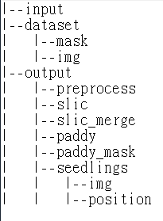

# Rice Seedling Detection
> This notebook detects rice seedlings from the input UAV images.
> for each input image:
>> output: 
>> 1. result image with the detected rice seedlings drawing on the image.
>> 2. .csv file with the position of detected rice seedlings.
##### Flowchart of rice seedling detection

### Acknowledgement
The images used in the research were provided by GEOSAT Aerospace & Technology Inc.

### Needed Package    
    * numpy
    * matplotlib.pyplot
    * cv2
    * skimage

### Usage
##### Folder Tree

##### build the dataset
    The labeled binary imgs in `./dataset/mask/` should be naming like: **`label`\_`imgName`.jpg**
    , where white pixels means the labeled area.

## TBC
