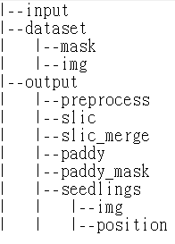

# Rice Seedling Detection

This notebook detects rice seedlings from the input UAV images.
> For each input image, output: 
> 1. Four result images with the detected rice seedlings drawing on the image.
> 2. .csv files with the position of detected rice seedlings.

##### Example
`input image`

`output images`
<table style="text-align: center;" cellpadding="0" border='0'>
    <tr>
        <td> 
            
            
Preprocess: grayscale

        </td>
        <td> 
            
            
Preprocess: CLAHE grayscale

        </td>
    </tr>
    <tr>
        <td> 
            
            
Preprocess: TGI

        </td>
        <td> 
            
            
Preprocess: VARI

        </td>
    </tr>
</table>

`output csv files`

### Acknowledgement
    The images used in the research were provided by GEOSAT Aerospace & Technology Inc.

### Data Acquisition
**Camera**: `Sony a7`
The camera was mounted on an UAV to fly along the designated route. 

**Captured date**: `6th, April, 2017`

**Image resolution**: `6000*4000 pixels`

**GSD**: about `0.72 cm/pixel`

**Flight place**: **TYDARES**, Taoyuan District Agricultural Research and Extension Station (`24°57'07.6"N, 121°01'41.8"E`)

**Flight path**:

 

### Test Field
 

`./input/`

 

## Rice Seedling Detection

**1. Paddy Field Extraction**
To extract paddy field, the superpixel image was generated by SLIC. Each superpixel was then labeled as paddy or NOT paddy, and the set of superpixels with paddy label were the extracted paddy field.
**2. Generating preprocessing images**
Preprocessing images: grayscale image, CLAHE grayscale image, TGI image, and VARI image.
**3. Blob detection**
Blob detection was applied on the extracted paddy field with different preprocessing images to test the performance on rice seedling detection.

**Flowchart of rice seedling detection:**

#### 1. Creating folders

#### 2. Building the dataset for paddy field extraction
The dataset consisting of different pre-labeled images is used for paddy field extraction.

The labeled binary images in `./dataset/mask/` should be named as **`labelName`\_`imgName`.jpg**.
White pixels in a labeled image represent the labeled area.

`./dataset/mask/`

 

`./dataset/img/`

 

#### 3. Import packages
    * numpy
    * matplotlib.pyplot
    * cv2
    * skimage
    * os
    * csv
    * time

### For each input image
#### Paddy Field Extraction
 

#### Generating the preprocessing images

`The preprocessing images:`
<table style="text-align: center;">
    <tr>
        <td> 
            
            
Grayscale image

        </td>
        <td> 
            
            
CLAHE grayscale image

        </td>
    </tr>
    <tr>
        <td> 
            
            
TGI image

        </td>
        <td> 
            
            
VARI image

        </td>
    </tr>
</table>

#### Blob detection
 
